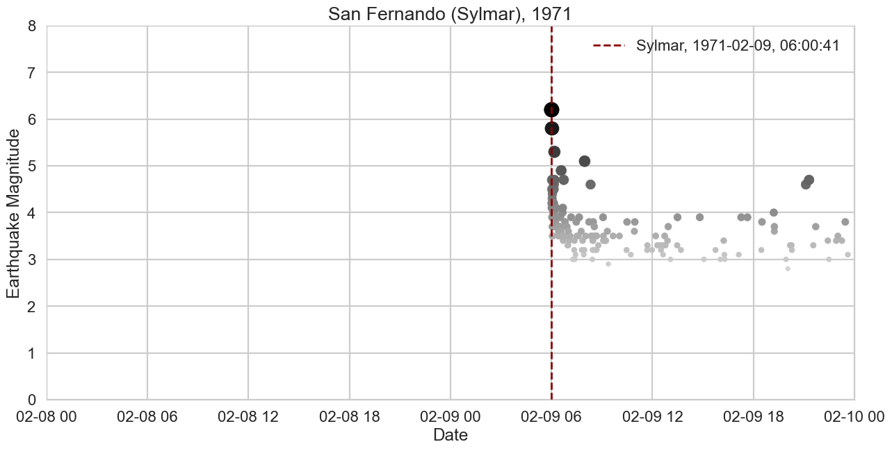
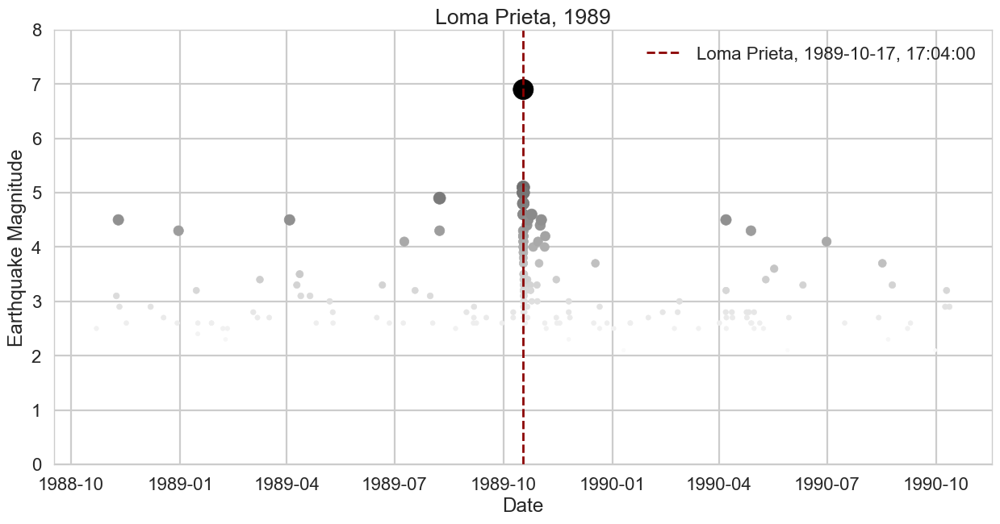
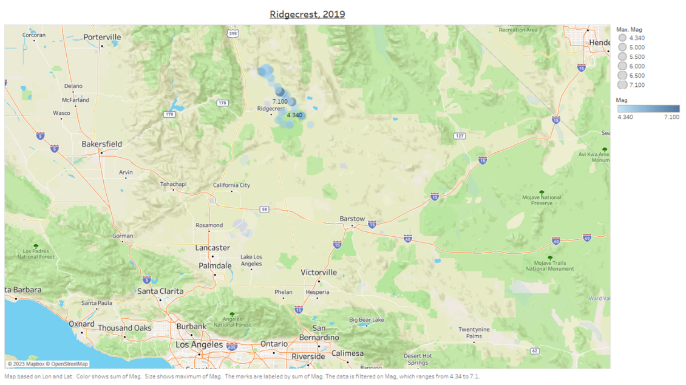

# Event-Extraction-from-Large-Seismic-Cataglogs
Python Code to extract events in time and space from large seismic catalog data. 

The code modules are exercised to extract sequences and latidue/longitude for 5 famous California earthquakes:

* 1971 San Fernando (Sylmar) Earthquake

* 1989 Loma Prieta Earthquake

* 1992 Landers Earthquake

* 1994 Northridge Earthquake

* 2019 Ridgecrest Earthquake

Output from the Notebook is summarized below.

This event extraction capability will be leveraged to build training datasets for the development of machine learning capabilities on seismic data.